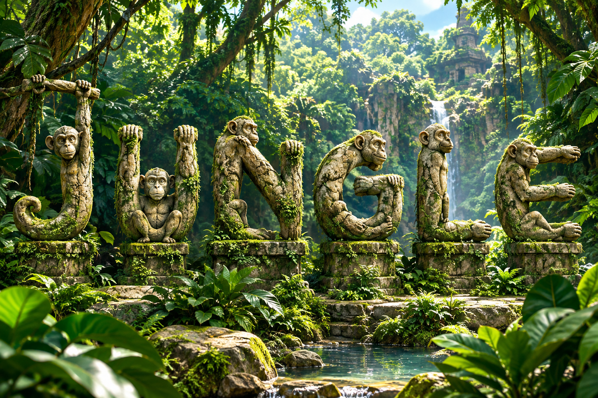

 # Environment support for jMonkeyEngine 3

 

 

## Instructions

Features:
* Provides a folder for saving games, settings and logs (on Windows is on the "SavedGames" system folder).
* Shows system information
